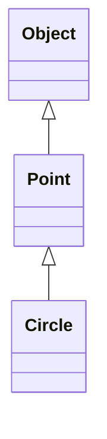
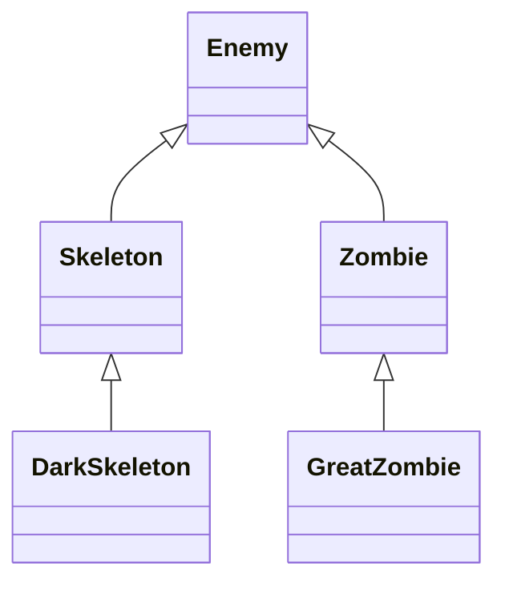

# Notes

## Inheritance
inheritance in programming is copying code from another class and then usually adding any additional features, data and/or changes

In java, we create inheritance with keyword **extends**

For example:

```java
class Circle extends Point {}
```

#### Super
A keyword which refers to your parent or super class. The class you inherited from.

For example, Circle's super-class is Point.

### Hard Rule #1

The child or sub-class's (Circle) constructor MUST call the super-class constructor FIRST.

### Overidden method

A method you have inherited from a super/parent class, that you remake and redefine, so that you can change its behavior.


## Important Notes
* We would say that Point "is an" Object
* We would say that Circle "is a" Point
* We would say that Circle "is an" Object
* We would **NOT** say that Point "is a" Circle

## Polymorphism
Poly -> many
Morph -> to Change

Polymorphism - the run-time ability for JAVA to take many Objects types and change them into their correct types.

## Polymorphism Example
Someone who does not know or believe in polymorphism would write:

```java
Arraylist<Skeleton> skell = new ArrayList<>();
Arraylist<Zombie> zom = new ArrayList<>();
Arraylist<Ghost> gho = new ArrayList<>();
Arraylist<Creeper> cree = new ArrayList<>();
```

Someone who understand polymorphism is going to write

```java
Arraylist<Enemy> allEnemies = new ArrayList<>();
```
